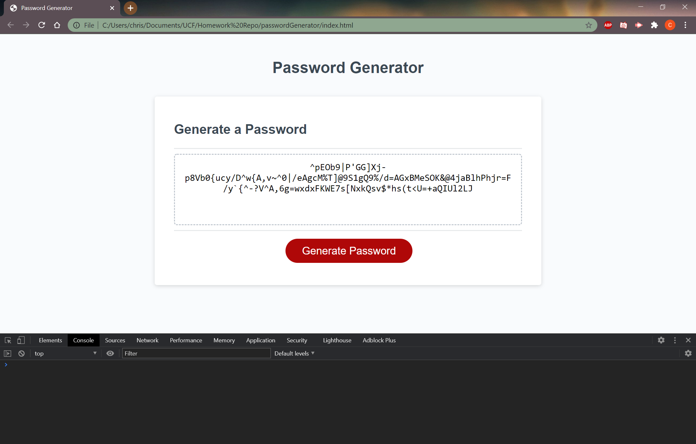

# passwordGenerator

This website will generate a random password upon clicking a button. After clicking Generate Password a prompt will pop up asking the user for the number of characters they want their password to be. If the length is less than 8, greater than 128, or not a number, an alert will pop up stating these are invalid inputs. Once the user has entered a valid length, then they will be prompted with several pop up windows asking them if they want numbers, uppercase letters, lowercase letters, and/or special characters. After deciding which type of characters they want their password to contain, the password will be generated and written to the box that contains the "Your Secure Password" message.

## Link to the project repository:
https://github.com/tiroxxx/passwordGenerator

## Link to project website:
https://tiroxxx.github.io/passwordGenerator/

